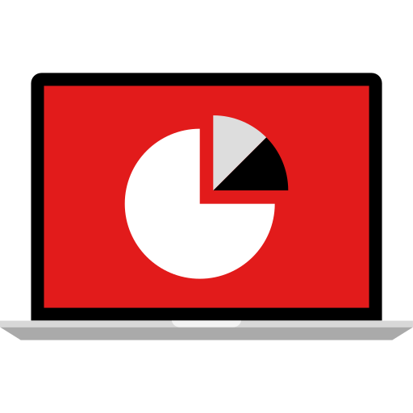
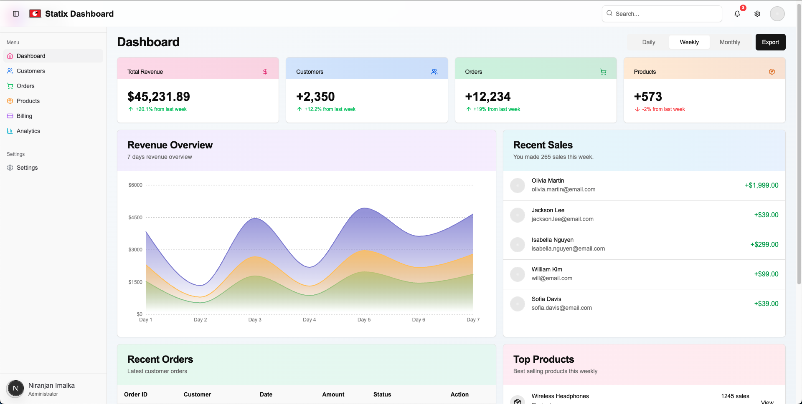
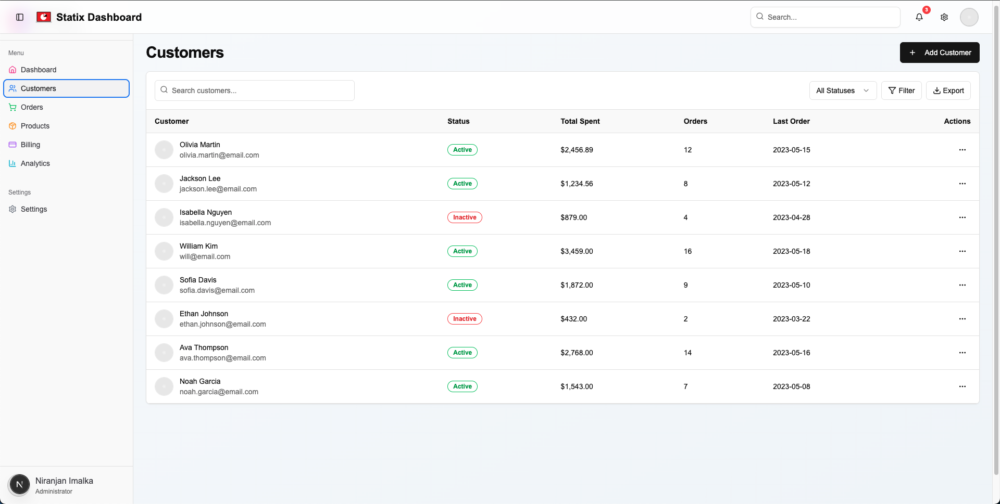
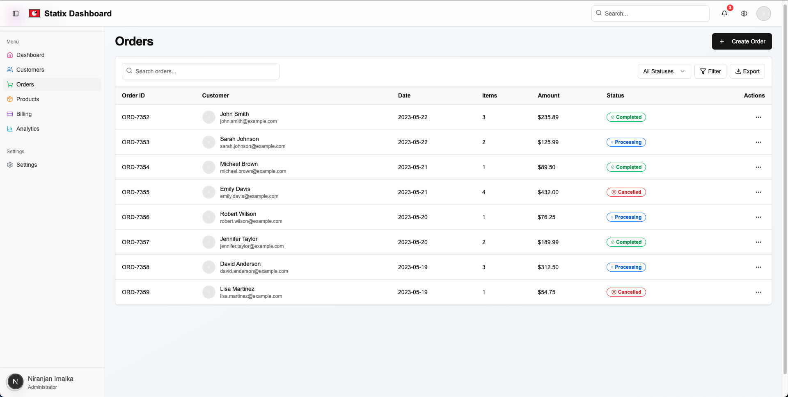
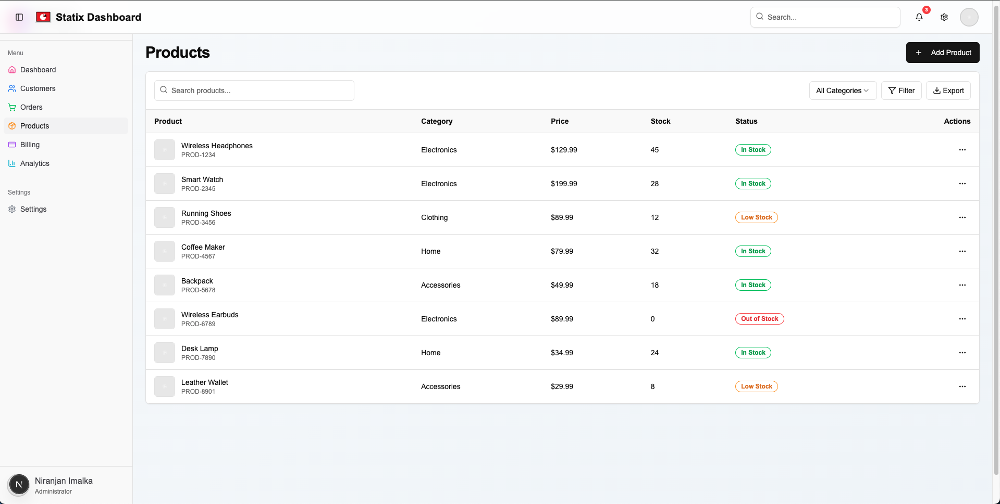
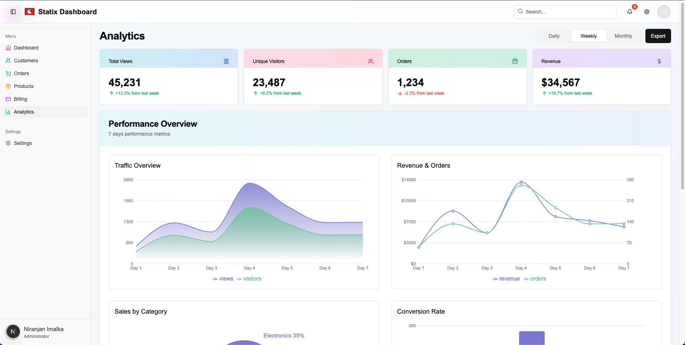

# Statix Admin Dashboard

<center></center>

A modern, colorful, and interactive admin dashboard built with Next.js, Tailwind CSS, and shadcn/ui components. This dashboard provides a comprehensive interface for managing customers, orders, products, billing, analytics, and settings.

## ✨ Features

- 🎨 **Vibrant UI** - Modern design with colorful gradients and interactive elements
- 📱 **Fully Responsive** - Works seamlessly on desktop, tablet, and mobile devices
- 🔄 **Interactive Charts** - Dynamic data visualization with Recharts
- 📊 **Real-time Analytics** - Comprehensive analytics with multiple chart types
- 👥 **Customer Management** - Complete customer database with filtering and search
- 🛒 **Order Tracking** - Order management system with status tracking
- 📦 **Product Inventory** - Product catalog with stock management
- 💳 **Billing System** - Payment tracking and invoice management
- ⚙️ **Customizable Settings** - User profile and application settings
- 🌓 **Dark Mode Support** - Toggle between light and dark themes

## 📸 Screenshots

### Dashboard


### Customers


### Orders


### Products


### Analytics


## 🚀 Getting Started

### Prerequisites

- Node.js 18.0 or later
- npm or yarn

### Installation

1. Clone the repository:
   ```bash
   git clone https://github.com/niranjanimalka98/statix-admin-dashboard.git
   ```
   ```bash
   cd statix-admin-dashboard

2. Install dependencies:
   ```bash
   npm install
   ```
   or
   ```bash
   yarn install

3. Run the development server:
   ```bash
   npm run dev
   ```
   or
   ```bash
   yarn dev
   ```

4. Open [http://localhost:3000](http://localhost:3000) in your browser to see the dashboard.

## 🛠️ Built With

- [Next.js](https://nextjs.org/) - React framework for production
- [React](https://reactjs.org/) - JavaScript library for building user interfaces
- [Tailwind CSS](https://tailwindcss.com/) - Utility-first CSS framework
- [shadcn/ui](https://ui.shadcn.com/) - Re-usable components built with Radix UI and Tailwind CSS
- [Recharts](https://recharts.org/) - Composable charting library built on React components
- [Lucide Icons](https://lucide.dev/) - Beautiful & consistent icon toolkit

## 📁 Project Structure

```
statix-admin-dashboard/
├── app/                    # Next.js app directory
│   ├── dashboard/          # Dashboard page
│   ├── customers/          # Customers page
│   ├── orders/             # Orders page
│   ├── products/           # Products page
│   ├── billing/            # Billing page
│   ├── analytics/          # Analytics page
│   ├── settings/           # Settings page
│   ├── layout.tsx          # Root layout
│   └── page.tsx            # Root page (redirects to dashboard)
├── components/             # React components
│   ├── dashboard/          # Dashboard components
│   ├── customers/          # Customer components
│   ├── orders/             # Order components
│   ├── products/           # Product components
│   ├── billing/            # Billing components
│   ├── analytics/          # Analytics components
│   ├── settings/           # Settings components
│   ├── ui/                 # UI components (shadcn)
│   ├── dashboard-header.tsx # Header component
│   ├── dashboard-sidebar.tsx # Sidebar component
│   └── dashboard-shell.tsx  # Shell component
├── public/                 # Static assets
├── styles/                 # Global styles
├── lib/                    # Utility functions
├── hooks/                  # Custom React hooks
├── .gitignore              # Git ignore file
├── next.config.js          # Next.js configuration
├── package.json            # Project dependencies
├── README.md               # Project documentation
└── tailwind.config.js      # Tailwind CSS configuration
```

## 🎨 Customization

### Changing Colors

The dashboard uses a custom color palette defined in `tailwind.config.js`. You can modify the colors to match your brand:

```js
// tailwind.config.js
module.exports = {
  theme: {
    extend: {
      colors: {
        // Customize your colors here
        primary: {...},
        secondary: {...},
        // ...
      }
    }
  }
}
```

### Adding New Pages

1. Create a new page in the `app` directory
2. Create corresponding components in the `components` directory
3. Add a new route to the sidebar in `components/dashboard-sidebar.tsx`

## 🤝 Contributing

Contributions are welcome! Please feel free to submit a Pull Request.

1. Fork the repository
2. Create your feature branch (`git checkout -b feature/amazing-feature`)
3. Commit your changes (`git commit -m 'Add some amazing feature'`)
4. Push to the branch (`git push origin feature/amazing-feature`)
5. Open a Pull Request

## 📄 License

This project is licensed under the MIT License - see the LICENSE file for details.

## 🙏 Acknowledgments

- [shadcn/ui](https://ui.shadcn.com/) for the amazing component library
- [Vercel](https://vercel.com) for the deployment platform
- [Next.js](https://nextjs.org/) for the React framework

---

Made with ❤️ by Niranjan(https://github.com/niranjanimalka98)
